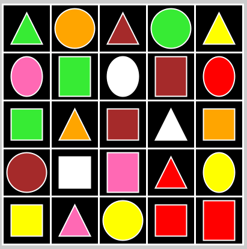

# Chocolate Box Simulation (Assignment 6)🍫🎮

Welcome to the Chocolate Box Simulation in Processing! 🍫 This interactive sketch lets you play with virtual chocolates by changing their flavors, shapes, and visibility.

## Code Structure 🧱

The code is organized into two main classes: `ChocoBox` and `ChocoCell`. Here's a breakdown of the structure:

### ChocoBox Class 📦

The `ChocoBox` class represents the chocolate box and is responsible for creating the grid of chocolate cells. It includes:

- `box`: An array of `ChocoCell` objects representing the individual chocolate cells.
- `rows`: Number of rows in the grid.
- `cols`: Number of columns in the grid.
- `cellSize`: Size of each cell.
- `flavors`: An array of colors representing chocolate flavors.
- `shapes`: An array of strings representing chocolate shapes.

### ChocoCell Class 🍬

The `ChocoCell` class represents an individual chocolate cell and manages its properties and behavior. It includes:

- `x`, `y`: Coordinates of the cell.
- `size`: Size of the cell.
- `flavorId`: Index of the current flavor in respect of flavors.
- `shapeId`: Index of the current shape in respect of shapes.
- `visible`: Whether the chocolate inside the cell is visible.
- `flavors`: Array of flavors shared across all cells.
- `shapes`: Array of shapes shared across all cells.

## Interaction 🕹️

- Use the keyboard ⌨️ & mouse 🖱️ to interact with the chocolates:

  - `Hover` on the desired cell to select it on the grid!
  - Press `Space` to toggle visibility.
  - Press `a` to select the next flavor.
  - Press `s` to select the previous flavor.
  - Press `d` to select the next shape.
  - Press `f` to select the previous shape.

- The `timeManager` related functions handles the timing for these interactions to prevent rapid changes.

## Bugs and Improvements 🐛🔧

- I don't think there is more optimization possible for this super-optimized code!
- I don't be buggy in small software like this!

## Disclaimer ⚠️

- I didn't explain the mathematical functions in depth! But i commented out what those functions are computing!
- Because explaining mathematical concepts in depth is not my responsibility here as I am not a math teacher!

Enjoy the chocolatey experience! 🍬🎉

Give a star⭐️ for this [project](https://github.com/ToxicalNoob3062/rahat_choco) if you liked it!

